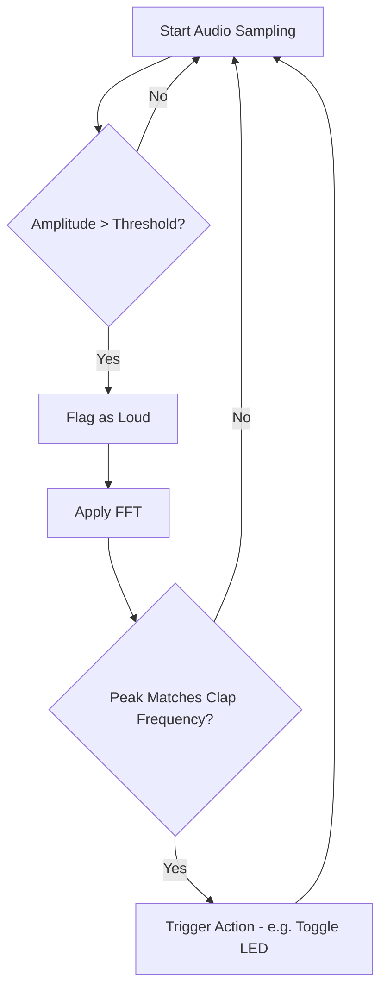

# 📘 Final Project Report  
## 🧠 Clap Detection System  

---

## 📄 Overview  

This project implements a simple and efficient clap detection system that can be integrated into smart home environments. It allows users to control home appliances—such as lights, fans, or TVs—by clapping.

The system focuses on detecting clap sounds using audio sampling and Fast Fourier Transform (FFT) for signal analysis. It is designed to be lightweight and fast enough to run on microcontrollers in real time.

---

## 🌟 Key Features
---

## 🔧 Hardware Components

- **STM32F411CEU6**  
  Serves as the main microcontroller for real-time audio sampling and FFT processing.

- **Analog Microphone**  
  Captures environmental sound and converts it into analog signals for the STM32 to sample.

- **SD Card Module**  
  Used for storing sampled sound data. This storage enables offline analysis to determine a suitable amplitude threshold for clap detection.
  

- **Real-time clap detection** using audio sampling and FFT  
- **Threshold-based sound activation** to filter out background noise  
- **FFT peak analysis** to identify the unique frequency signature of a clap  
- **Efficient implementation** suitable for microcontrollers  
- **Support for overlapping sample windows** to avoid missing claps  

---

## ⚙️ How It Works  

### 1. Audio Sampling  

- The system continuously samples sound data at 16,000 Hz with 128 samples per batch.
- Each sample is checked against a defined amplitude threshold to identify potential claps.
- If any value exceeds the threshold, the system flags the batch for further analysis.

### 2. Fast Fourier Transform (FFT)  

- Once a batch is flagged, FFT is applied to analyze the frequency domain.
- A pre-computed sine/cosine table is used instead of function calls to improve speed.
- The system identifies the peak frequency index and compares it with a known clap frequency.

### 3. Decision Making  

- If the peak index matches the target clap frequency index, the system triggers an action (e.g., toggling an LED or appliance).
- Overlapping sampling is used to improve accuracy and reduce missed detections.

---

## 🧪 Technical Notes  

- **FFT Execution Time**: ~1 ms  
- **Sample Collection Time (128 samples)**: 8 ms  
- **Optimizations**:  
  - Precomputed trigonometric values  
  - Double-buffered overlapping arrays  
  - Threshold checks to filter ambient noise  

---

## 🏠 Applications  

- Smart lighting systems  
- Home automation  
- Gesture-based control interfaces  
- Energy-efficient control systems  

---

## 🔁 System Flow (Mermaid Diagram)

---
## 🎥 Clap Detection Demo  

## 🔗 References

1. [GeeksforGeeks: FFT for Polynomial Multiplication](https://www.geeksforgeeks.org/fast-fourier-transformation-poynomial-multiplication/)  
   Overview of how FFT optimizes polynomial multiplication.

2. [VNOI: Computational Complexity](https://vnoi.info/wiki/translate/topcoder/Computational-Complexity-Section-1.md)  
   Summary of core concepts in computational complexity.

3. [VNOI: FFT Algorithm](https://vnoi.info/wiki/algo/trick/FFT.md)  
   Description and implementation of FFT in competitive programming.

4. [Example FFT in C](https://lloydrochester.com/post/c/example-fft/)  
   A practical FFT example written in C for signal analysis.

5. [ETH Project Report: Clap Detection](https://pub.tik.ee.ethz.ch/students/2013-FS/GA-2013-03.pdf)  
   Student research project using FFT for clap detection on microcontrollers.

6. [YorkU Lab: Claps vs. Noises](https://www.eecs.yorku.ca/course_archive/2019-20/W/1011/labs/4/distinguishing-between-claps-and-other-noises.html)  
   Lab exercise on differentiating claps from background noise.  

- GeeksforGeeks: Fast Fourier Transformation  
- VNOI FFT Wiki and Algorithm Tricks  
- ETH Zurich Student Projects on FFT  
- York University Labs: Distinguishing Between Claps and Other Noises  

---

*End of Report*
